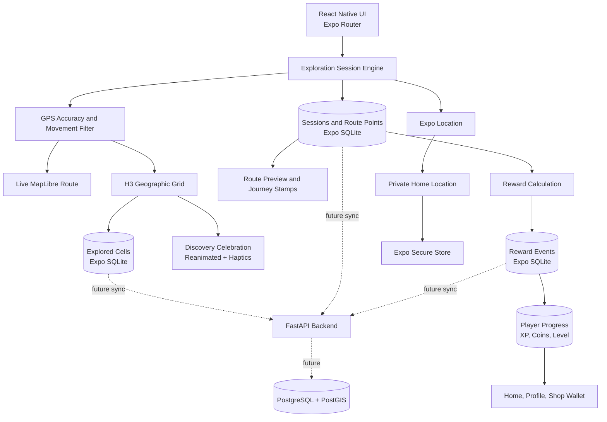

<div align="center">

# ARUKIYO

### Walk. Discover. Unlock the world.

**歩いて、世界をひらく。**

A Japanese-inspired mobile exploration game that turns real-world movement into progress, discovery, collections, and adventure.

[](#development-progress)
[](#technology)
[](#technology)
[](#technology)
[](LICENSE)

</div>

---

## About Arukiyo

Arukiyo is a mobile application built around one simple idea:

> Leave the house, explore the real world, and gradually reveal your own map.

The application combines real-world walking, location-based discovery, game progression, Japanese-inspired visual design, daily challenges, collectible landmarks, badges, rewards, and a persistent **fog-of-war** map.

Users begin from a private **Home** area and unlock new roads, locations, and map cells as they travel. Important places such as monuments, museums, parks, historical buildings, and landmarks will become collectible discoveries with their own information, rewards, stamps, and profile badges.

## Current experience

The current Android development build already includes:

- a complete Japanese-inspired mobile interface;
- Home, Explore, Quests, Journal, Profile, and Shop sections;
- real foreground GPS positioning;
- an encrypted private Home location stored on the device;
- a real interactive MapLibre map;
- H3-based geographic exploration cells;
- persistent discovered cells stored in SQLite;
- a functional fog-of-war system;
- live foreground exploration sessions;
- a real route line drawn from accepted GPS points;
- live distance, duration, GPS-point, and new-cell counters;
- GPS quality filtering for inaccurate, duplicated, stale, and implausible points;
- persistent session summaries and route-point storage in SQLite;
- a local exploration-session history;
- completed and interrupted-session handling;
- real XP and coin rewards calculated from exploration;
- persistent levels and explorer ranks;
- first-journey and one-kilometre daily bonuses;
- duplicate-reward prevention for reopened sessions;
- retroactive rewards for eligible Stage 3A sessions;
- real progression statistics on Home and Profile;
- a Shop wallet connected to earned exploration coins;
- animated new-area discovery feedback with sakura petals;
- haptic feedback for discoveries, completed journeys, and level-ups;
- animated XP and coin totals for newly completed sessions;
- a MapLibre route preview with start and finish markers in journey summaries;
- collectible-style Journey Stamps for meaningful session achievements;
- reduced-motion support for accessibility preferences;
- English-first localization with Romanian, Japanese, and device-language modes;
- dedicated Settings and Language screens;
- wireless Android development and physical-device testing.

## Core product vision

Arukiyo is planned as a progressive real-world exploration RPG with:

- exploration percentages for Home area, neighbourhood, city, region, country, continent, and world;
- roads and map areas revealed through real movement;
- collectible landmarks with history, rarity, rewards, and equippable badges;
- XP, levels, explorer ranks, coins, Sakura Shards, streaks, and achievements;
- daily, weekly, and monthly missions;
- distance, walking, discovery, history, photography, and travel progression paths;
- a cosmetic shop with themes, profile frames, map styles, mascots, and effects;
- a Japanese stamp-book travel journal;
- seasonal collections and exploration events;
- optional friends, teams, and group expeditions;
- route memories and generated travel postcards;
- offline exploration support;
- future augmented-reality discovery features;
- privacy controls, safety rules, accessibility options, and anti-cheat protection.

## Development progress

| Stage | Status | Scope |
| --- | ---: | --- |
| Stage 0 | ✅ Complete | Windows environment, Expo project, Android SDK, JDK 17, physical-device build |
| Stage 1A | ✅ Complete | Arukiyo visual identity, tabs, Home, Quests, Journal, Profile, and Shop prototypes |
| Stage 2A | ✅ Complete | Foreground GPS, encrypted Home location, permission handling, location accuracy |
| Stage 2B | ✅ Complete | MapLibre map, H3 cells, SQLite persistence, live exploration, fog of war |
| Stage 2C | ✅ Complete | English-first localization, Romanian and Japanese, map polish, real Home icon |
| Stage 3A | ✅ Complete | Persistent sessions, live route, distance, duration, GPS filtering, summaries, and history |
| Stage 3B | ✅ Complete | XP, levels, coins, reward rules, daily bonuses, real dashboard statistics, and wallet |
| Stage 3C | ✅ Complete | Discovery celebrations, haptics, animated rewards, route previews, Journey Stamps, reduced motion |
| Stage 3D | ⏭ Next | Standalone Android preview, outdoor field validation, Hanko Path identity, and screenshot gallery |
| Stage 4 | Planned | Landmark discovery, collections, badges, historical information |
| Stage 5 | Planned | Accounts, synchronization, FastAPI backend, PostgreSQL and PostGIS |

> Arukiyo is under active development and is not yet a production release.

## Map and exploration model

Arukiyo converts GPS coordinates into H3 hexagonal cells. Entering a sufficiently accurate cell records it locally as discovered. During an active session, accepted GPS points also form a persistent real-world route.

| Map state | Meaning |
| --- | --- |
| Dark hexagon | Undiscovered fog-of-war cell |
| Pink hexagon | Previously discovered cell |
| Gold hexagon | Current cell |
| Green marker | Current GPS position |
| Red marker | Private Home location |
| Red route line | Accepted movement during the current session |

Exploration cells, sessions, session statistics, accepted route points, reward events, and player progression are persisted locally in SQLite. The exact Home coordinate is stored separately through Expo Secure Store and is not uploaded to a server in the current implementation.

## Session tracking and GPS validation

Stage 3A records foreground exploration sessions while the application is open. Each accepted point stores its coordinates, timestamp, accuracy, altitude, speed, heading, and route sequence.

A point can be filtered when:

- reported accuracy is worse than the configured threshold;
- it is too close to the previous accepted point;
- its timestamp is stale or invalid;
- the implied movement speed is implausible for walking exploration.

Filtered points do not increase route distance or create false route segments. If foreground tracking is interrupted, the active session is finalized and preserved as an interrupted journey instead of being silently lost.

## Progression and reward model

Stage 3B connects completed exploration data to a persistent local progression system.

### XP and coins

| Activity | XP | Coins |
| --- | ---: | ---: |
| Every validated 50 m | 1 | — |
| Every validated 250 m | — | 1 |
| Every newly discovered H3 cell | 10 | 2 |
| Meaningful completed session | 5 | 1 |
| First meaningful completed session of the day | 25 | 5 |
| First completed session of at least 1 km that day | 50 | 10 |

A meaningful completed session contains at least 50 metres of validated movement or at least one newly discovered cell.

Interrupted sessions still receive distance and discovery rewards, but do not receive completion or daily-completion bonuses.

### Duplicate protection

Every rewarded session receives one unique reward event. Reopening a summary from History does not grant XP or coins again. Daily bonus indexes also prevent the first-session and one-kilometre bonuses from being claimed more than once per local day.

### Levels and ranks

Level 1 requires 100 XP to advance. The XP required for each later level increases by 75.

| Levels | Explorer rank |
| --- | --- |
| 1–4 | Wanderer |
| 5–9 | Pathfinder |
| 10–19 | Trailblazer |
| 20–34 | Voyager |
| 35+ | World Walker |

Rank names are localized in English, Romanian, and Japanese.

## Discovery feedback and journey presentation

Stage 3C turns raw exploration events into visible and tactile journey moments.

### New-area celebration

When a new H3 cell is discovered, Arukiyo displays a temporary overlay containing:

- a Japanese-inspired discovery seal;
- a new-area message and shortened cell identifier;
- sakura-petal animation;
- reward information when the discovery occurred during an active session;
- a short haptic impact.

The overlay disappears automatically and does not block map interaction. When the system reduced-motion preference is active, the information remains available while the larger motion effects are reduced.

### Journey summary

A newly completed session can present:

- animated XP and coin totals;
- success haptics, with stronger feedback for Level Up;
- a MapLibre mini-map of the accepted route;
- separate start and finish markers;
- Journey Stamps for first journey, one-kilometre session, newly discovered territory, and completed exploration.

Opening an older session from History does not replay reward haptics or simulate a newly granted reward.

## Languages

Arukiyo currently provides:

- **English** as the default language;
- **Romanian**;
- **Japanese**;
- a **Use device language** mode that follows Android when the language is supported.

The selected language is stored locally and restored when the application is reopened.

## Technology

| Area | Technology |
| --- | --- |
| Mobile application | React Native 0.86 + TypeScript |
| Development platform | Expo SDK 57 + Expo Router |
| Android build | Android SDK 36, Gradle, JDK 17 |
| Map rendering | MapLibre React Native |
| Geographic grid | H3 |
| Local structured storage | Expo SQLite |
| Sensitive local storage | Expo Secure Store |
| Foreground location | Expo Location |
| Motion and interface feedback | React Native Reanimated + Expo Haptics |
| Localization | i18next + react-i18next + Expo Localization |
| Planned backend | FastAPI |
| Planned database | PostgreSQL + PostGIS |
| Planned caching/tasks | Redis |

## Architecture



## Repository structure

```text
Arukiyo/
├── assets/                  App icons, splash assets, and images
├── scripts/                 Required build helpers and compatibility patches
├── src/
│   ├── app/                 Expo Router screens, dashboards, history, and summaries
│   ├── components/          MapLibre, celebrations, counters, and reusable interface pieces
│   ├── constants/           Theme, exploration, and progression configuration
│   ├── hooks/               Exploration, progression, and accessibility state
│   ├── i18n/                English, Romanian, and Japanese resources
│   ├── lib/                 H3, SQLite, GPS filtering, rewards, haptics, and secure storage
│   └── providers/           Application-level language state
├── app.json                 Expo application configuration
├── package.json             Dependencies and project commands
└── README.md
```

The native `android/` and `ios/` directories are generated locally through Expo Prebuild and are intentionally excluded from Git.

## Development setup

### Requirements

- Windows 11;
- Node.js 24 LTS;
- npm 11 or newer;
- JDK 17;
- Android Studio;
- Android SDK Platform 36 and Build Tools 36;
- an Android physical device or emulator;
- USB debugging or Wireless debugging.

### Install dependencies

```powershell
npm install
```

The project contains a post-install compatibility patch for the current `h3-js` and Hermes combination.

### Generate the Android project

```powershell
npx expo prebuild --clean --platform android
powershell -ExecutionPolicy Bypass -File .\scripts\fix-gradle-jvm.ps1
```

### Build and install the development application

```powershell
adb devices -l
npx expo run:android --device
```

### Start normal development

After the native development build is installed:

```powershell
npm run dev
```

Routine TypeScript and interface changes do not require rebuilding the APK. A new native build is required after adding or changing native modules.

## Stage 3C validation flow

1. Confirm that the native Android build includes Expo Haptics and starts successfully.
2. Discover a new H3 cell and confirm that the discovery card, sakura animation, and haptic impact appear.
3. Confirm that an active-session discovery displays its XP and coin reward.
4. Confirm that a discovery outside a session is marked as stored locally without claiming a session reward.
5. Complete a session and confirm that XP and coin totals animate only for the newly completed journey.
6. Confirm that normal completion triggers success haptics and Level Up triggers stronger feedback.
7. Confirm that the journey summary displays the accepted route with start and finish markers when at least two GPS points exist.
8. Confirm that relevant Journey Stamps appear and remain localized.
9. Open an old journey from History and confirm that reward haptics and count-up animations are not replayed.
10. Enable reduced motion and confirm that all information remains available without relying on large animations.
11. Re-test Explore and Session Summary in English, Romanian, and Japanese.
12. Run TypeScript, ESLint, Expo Doctor, and whitespace validation before integration.

## Brand direction

The selected identity direction is **Hanko Path**:

- a vermilion circular seal inspired by a Japanese hanko;
- a path that subtly forms the letter **A**;
- a small destination sun or point at the end of the route;
- one restrained sakura-petal accent;
- ink-green, paper-cream, vermilion, and sakura-pink as the primary palette.

The final identity will include an Android icon, adaptive icon, splash artwork, wordmark, light version, dark version, and monochrome mark.

## Screenshots

The public gallery will be prepared after the Stage 3D standalone Android field test. Real route, new-cell, and Level Up captures require a build that runs without Metro or a shared Wi-Fi connection.

Planned presentation panels:

- **Overview** — Home progression, Explore map, and completed-session summary;
- **Journey** — live route, new-area discovery, and session history;
- **Progression** — Level Up, Profile rank, and Shop wallet.

Public screenshots will use English, avoid private Home coordinates, and be composed into consistent phone mockups on a Japanese paper-inspired background.

## Privacy and safety principles

Arukiyo is designed around privacy-aware location handling:

- Home is treated as sensitive information;
- exact Home coordinates are stored locally in encrypted storage;
- public interfaces will use an approximate Home area;
- location tracking is currently foreground-only;
- sessions are finalized if foreground tracking is interrupted;
- users will receive explicit controls before background tracking is introduced;
- live location sharing will never be enabled by default;
- private property, unsafe areas, and inaccessible locations must not become mandatory objectives;
- users will be able to delete local exploration and location data.

## Known development notes

- The current MapLibre style uses development/demo tiles and will be replaced before release.
- Foreground exploration works; background exploration is intentionally disabled.
- The current development build depends on Metro for JavaScript delivery; a standalone internal preview is the next field-testing target.
- GPS and reward thresholds are initial development values and will be tuned through additional outdoor testing.
- Shop prices and wallet visibility are connected, but purchases and inventory are not implemented yet.
- `h3-js` currently needs a small Hermes compatibility patch, applied automatically after `npm install`.
- Gradle is pinned to Java 17 through the project helper script.
- Do not run `npm audit fix --force` without reviewing Expo and React Native compatibility.

## Contributing

Arukiyo is currently developed as a focused personal project. Issues and implementation discussions may be opened as the project moves closer to a public testing phase.

Please do not submit large architectural changes without prior discussion, because the mobile, geographic, progression, and backend systems are being introduced incrementally by development stage.

## Author

**Eduard Donea** — [EdisonSenpai](https://github.com/EdisonSenpai)

## License

Arukiyo is released under the [MIT License](LICENSE).

Third-party frameworks, libraries, map data, fonts, icons, and other assets remain subject to their respective licenses and attribution requirements.

---

<div align="center">

**Arukiyo — your world begins one step from home.**

</div>
