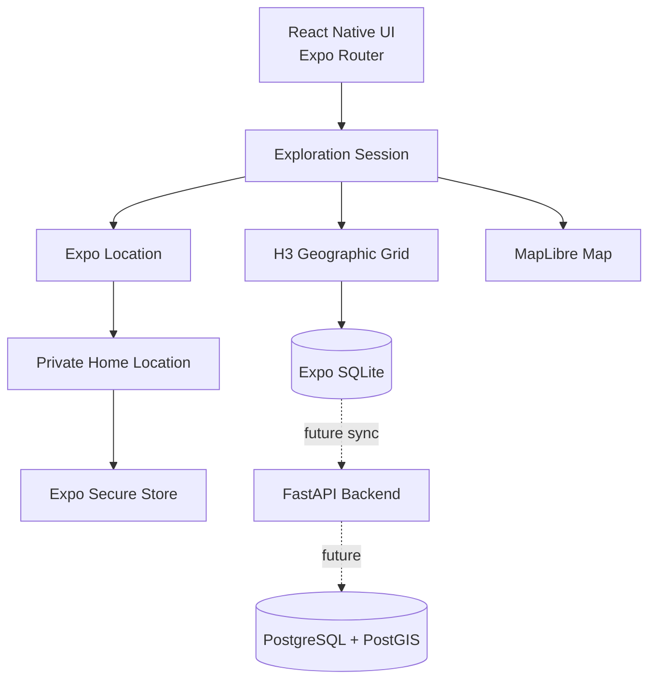

<div align="center">

# ARUKIYO

### Walk. Discover. Unlock the world.

**歩いて、世界をひらく。**

A Japanese-inspired mobile exploration game that turns real-world movement into progress, discovery, collections, and adventure.

[](#development-progress)
[](#technology)
[](#technology)
[](#technology)
[](LICENSE)

</div>

---

## About Arukiyo

Arukiyo is a mobile application built around one simple idea:

> Leave the house, explore the real world, and gradually reveal your own map.

The application combines real-world walking, location-based discovery, game progression, Japanese-inspired visual design, daily challenges, collectible landmarks, badges, rewards, and a persistent **fog-of-war** map.

Users begin from a private **Home** area and unlock new roads, locations, and map cells as they travel. Important places such as monuments, museums, parks, historical buildings, and landmarks will become collectible discoveries with their own information, rewards, stamps, and profile badges.

## Current experience

The current Android development build already includes:

- a complete Japanese-inspired mobile interface;
- Home, Explore, Quests, Journal, Profile, and Shop sections;
- real foreground GPS positioning;
- an encrypted private Home location stored on the device;
- a real interactive MapLibre map;
- H3-based geographic exploration cells;
- persistent discovered cells stored in SQLite;
- a first functional fog-of-war system;
- live foreground exploration sessions;
- current-location and Home map markers;
- local completion statistics and exploration reset tools;
- English-first localization with Romanian, Japanese, and device-language modes;
- dedicated Settings and Language screens;
- a visible Home icon and clearer roads beneath the fog-of-war layer;
- wireless Android development and physical-device testing.

## Core product vision

Arukiyo is planned as a progressive real-world exploration RPG with:

- exploration percentages for Home area, neighbourhood, city, region, country, continent, and world;
- roads and map areas revealed through real movement;
- collectible landmarks with history, rarity, rewards, and equippable badges;
- XP, levels, explorer ranks, coins, Sakura Shards, streaks, and achievements;
- daily, weekly, and monthly missions;
- distance, walking, discovery, history, photography, and travel progression paths;
- a cosmetic shop with themes, profile frames, map styles, mascots, and effects;
- a Japanese stamp-book travel journal;
- seasonal collections and exploration events;
- optional friends, teams, and group expeditions;
- route memories and generated travel postcards;
- offline exploration support;
- future augmented-reality discovery features;
- privacy controls, safety rules, accessibility options, and anti-cheat protection.

## Development progress

| Stage | Status | Scope |
|---|---:|---|
| Stage 0 | ✅ Complete | Windows environment, Expo project, Android SDK, JDK 17, physical-device build |
| Stage 1A | ✅ Complete | Arukiyo visual identity, tabs, Home, Quests, Journal, Profile, and Shop prototypes |
| Stage 2A | ✅ Complete | Foreground GPS, encrypted Home location, permission handling, location accuracy |
| Stage 2B | ✅ Complete | MapLibre map, H3 cells, SQLite persistence, live exploration, fog of war |
| Stage 2C | ✅ Complete | English-first localization, Romanian and Japanese, map polish, real Home icon |
| Stage 3 | ⏭ Next | Route distance, session history, XP, rewards, and discovery animations |
| Stage 4 | Planned | Landmark discovery, collections, badges, historical information |
| Stage 5 | Planned | Accounts, synchronization, FastAPI backend, PostgreSQL and PostGIS |

> Arukiyo is under active development and is not yet a production release.

## Map and exploration model

Arukiyo currently converts GPS coordinates into H3 hexagonal cells. Entering a cell records it locally as discovered.

| Map state | Meaning |
|---|---|
| Dark hexagon | Undiscovered fog-of-war cell |
| Pink hexagon | Previously discovered cell |
| Gold hexagon | Current cell |
| Green marker | Current GPS position |
| Red marker | Private Home location |

Exploration data is persisted locally in SQLite. The exact Home coordinate is stored separately through Expo Secure Store and is not uploaded to a server in the current implementation.

## Languages

Arukiyo currently provides:

- **English** as the default language;
- **Romanian**;
- **Japanese**;
- a **Use device language** mode that follows Android when the language is supported.

The selected language is stored locally and restored when the application is reopened.

## Technology

| Area | Technology |
|---|---|
| Mobile application | React Native 0.86 + TypeScript |
| Development platform | Expo SDK 57 + Expo Router |
| Android build | Android SDK 36, Gradle, JDK 17 |
| Map rendering | MapLibre React Native |
| Geographic grid | H3 |
| Local structured storage | Expo SQLite |
| Sensitive local storage | Expo Secure Store |
| Foreground location | Expo Location |
| Planned backend | FastAPI |
| Planned database | PostgreSQL + PostGIS |
| Planned caching/tasks | Redis |

## Architecture



## Repository structure

```text
Arukiyo/
├── assets/                  App icons, splash assets, and images
├── scripts/                 Build helpers and compatibility patches
├── src/
│   ├── app/                 Expo Router screens and layouts
│   ├── components/          Reusable interface and map components
│   ├── constants/           Theme and exploration configuration
│   ├── hooks/               Exploration and location state
│   └── lib/                 H3, SQLite, and secure-storage utilities
├── android/                 Generated native Android project
├── app.json                 Expo application configuration
├── package.json             Dependencies and project commands
└── README.md
```

## Development setup

### Requirements

- Windows 11;
- Node.js 24 LTS;
- npm 11 or newer;
- JDK 17;
- Android Studio;
- Android SDK Platform 36 and Build Tools 36;
- an Android physical device or emulator;
- USB debugging or Wireless debugging.

### Install dependencies

```powershell
npm install
```

The project contains a post-install compatibility patch for the current `h3-js` and Hermes combination.

### Generate the Android project

```powershell
npx expo prebuild --clean --platform android
powershell -ExecutionPolicy Bypass -File .\scripts\fix-gradle-jvm.ps1
```

### Build and install the development application

```powershell
adb devices -l
npx expo run:android --device
```

### Start normal development

After the native development build is installed:

```powershell
npx expo start --dev-client --lan
```

Routine TypeScript and interface changes do not require rebuilding the APK. A new native build is required after adding or changing native modules.

## Current validation flow

1. Confirm that the app starts in English by default.
2. Open **Profile -> Settings -> Language**.
3. Test English, Romanian, Japanese, and device-language mode.
4. Close and reopen the app and confirm that the language persists.
5. Open **Explore**.
6. Grant precise foreground location permission.
7. Press **Start exploring**.
8. Confirm that the GPS marker, current hexagon, and Home marker appear.
9. Configure the private Home location if it is not configured.
10. Walk into another H3 cell with the application open.
11. Confirm that visited cells remain discovered after restarting the app.
12. Use **Reset fog** only when testing local progression from zero.

## Screenshots

Clean in-app screenshots will be added after the Stage 3 route, distance, and reward pass, when the primary exploration interface is stable.

Planned gallery:

- Home dashboard;
- MapLibre exploration and fog of war;
- quests and streaks;
- Japanese travel journal;
- profile badges and collections;
- cosmetic shop.

## Privacy and safety principles

Arukiyo is designed around privacy-aware location handling:

- Home is treated as sensitive information;
- exact Home coordinates are stored locally in encrypted storage;
- public interfaces will use an approximate Home area;
- location tracking is currently foreground-only;
- users will receive explicit controls before background tracking is introduced;
- live location sharing will never be enabled by default;
- private property, unsafe areas, and inaccessible locations must not become mandatory objectives;
- users will be able to delete local exploration and location data.

## Known development notes

- The current MapLibre style uses development/demo tiles and will be replaced before release.
- Foreground exploration works; background exploration is intentionally disabled.
- `h3-js` currently needs a small Hermes compatibility patch, applied automatically after `npm install`.
- Gradle is pinned to Java 17 through the project helper script.
- Do not run `npm audit fix --force` without reviewing Expo and React Native compatibility.

## Contributing

Arukiyo is currently developed as a focused personal project. Issues and implementation discussions may be opened as the project moves closer to a public testing phase.

Please do not submit large architectural changes without prior discussion, because the mobile, geographic, progression, and backend systems are being introduced incrementally by development stage.

## Author

**Eduard Donea** — [EdisonSenpai](https://github.com/EdisonSenpai)

## License

Arukiyo is released under the [MIT License](LICENSE).

Third-party frameworks, libraries, map data, fonts, icons, and other assets remain subject to their respective licenses and attribution requirements.

---

<div align="center">

**Arukiyo — your world begins one step from home.**

</div>
