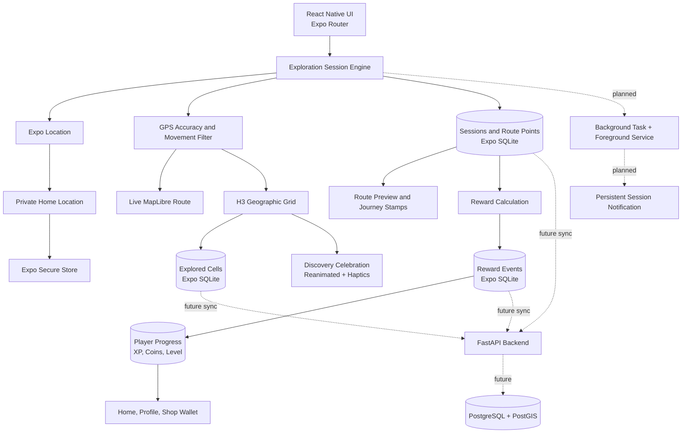

<div align="center">


# ARUKIYO

### Walk. Discover. Unlock the world.

**歩いて、世界をひらく。**

A Japanese-inspired mobile exploration game that turns real-world movement into progress, discovery, collections, and adventure.

[](#development-progress)
[](#android-build-variants)
[](#technology)
[](#technology)
[](LICENSE)

</div>

---

## About Arukiyo

Arukiyo is built around one simple idea:

> Leave the house, explore the real world, and gradually reveal your own map.

The application combines real-world walking, location-based discovery, Japanese-inspired visual design, persistent fog of war, journey tracking, progression, daily challenges, collectibles, and future social exploration.

Users begin from a private Home area and reveal new H3 cells as they move. Future stages will turn landmarks, museums, monuments, parks, historic buildings, and other points of interest into collectible discoveries with information, stamps, badges, rare rewards, and journal entries.

## Current experience

The current Android build includes:

- Home, Explore, Quests, Journal, Profile, Settings, Language, History, Summary, and Shop screens;
- real foreground GPS positioning;
- an encrypted private Home location stored locally;
- MapLibre rendering with H3 exploration cells;
- persistent discovered cells and fog-of-war state in SQLite;
- foreground exploration sessions with accepted and filtered GPS points;
- a live route line, distance, duration, GPS-point, and new-cell counters;
- GPS filtering for inaccurate, duplicated, stale, and implausible points;
- persistent session summaries, route points, and local history;
- real XP, coins, levels, ranks, and daily bonuses;
- duplicate-reward protection;
- animated discovery feedback with sakura petals;
- haptic feedback for discoveries, completed journeys, and Level Up;
- animated XP and coin totals for newly completed sessions;
- route previews with start and finish markers;
- Journey Stamps for meaningful session achievements;
- reduced-motion support;
- English, Romanian, Japanese, and device-language modes;
- a final Hanko Path — Sakura visual identity;
- separate Development, Preview, and Production application variants;
- a standalone Android Preview APK that runs without Metro.

## Core product vision

Arukiyo is planned as a real-world exploration RPG with:

- exploration percentages for Home area, neighbourhood, city, region, country, continent, and world;
- roads, buildings, neighbourhoods, and map areas revealed through real movement;
- collectible landmarks with history, rarity, rewards, and equippable badges;
- XP, levels, explorer ranks, coins, Sakura Shards, streaks, and achievements;
- daily, weekly, monthly, seasonal, and landmark-based missions;
- walking, discovery, history, photography, and travel progression paths;
- a cosmetic shop with themes, profile frames, map styles, companions, and effects;
- a Japanese stamp-book travel journal;
- optional friends, profiles, presence, teams, shared expeditions, and privacy-aware comparisons;
- route memories and generated travel postcards;
- offline-first exploration with later synchronization;
- future augmented-reality discovery features;
- background session tracking with explicit controls and visible Android session status;
- safety controls, accessibility, privacy, data deletion, and anti-cheat protection.

## Development progress

| Stage | Status | Scope |
| --- | ---: | --- |
| Stage 0 | ✅ Complete | Windows environment, Expo project, Android SDK, JDK 17, physical-device build |
| Stage 1A | ✅ Complete | Visual identity, tabs, Home, Quests, Journal, Profile, and Shop prototypes |
| Stage 2A | ✅ Complete | Foreground GPS, encrypted Home location, permissions, and location accuracy |
| Stage 2B | ✅ Complete | MapLibre, H3 cells, SQLite persistence, live exploration, and fog of war |
| Stage 2C | ✅ Complete | English-first localization, Romanian and Japanese, map polish, Home marker |
| Stage 3A | ✅ Complete | Persistent sessions, live route, GPS filtering, summaries, and history |
| Stage 3B | ✅ Complete | XP, levels, coins, reward rules, daily bonuses, dashboards, and wallet |
| Stage 3C | ✅ Complete | Discovery celebrations, haptics, animated rewards, route previews, Journey Stamps |
| Stage 3D | ✅ Complete | Hanko Path — Sakura brand, Android variants, EAS Preview APK, standalone field validation |
| Stage 4 | ⏭ Next | Session-state fix, richer basemap, landmarks, collections, badges, achievements, Sakura Shards |
| Stage 5 | Planned | Accounts, synchronization, backend, friends, presence, shared progress, teams |

> Arukiyo is under active development and is not yet a production release.

## Map and exploration model

Arukiyo converts GPS coordinates into H3 hexagonal cells. Entering a sufficiently accurate cell records it locally as discovered. During an active session, accepted GPS points form a persistent route.

| Map state | Meaning |
| --- | --- |
| Dark hexagon | Undiscovered fog-of-war cell |
| Pink hexagon | Previously discovered cell |
| Gold hexagon | Current cell |
| Green marker | Current GPS position |
| Red marker | Private Home location |
| Red route line | Accepted movement during the current session |

The current map style is intentionally temporary. It proves GPS, H3, fog-of-war, and route rendering, but it does not yet provide the street, building, neighbourhood, and point-of-interest detail expected from the final product. Stage 4 will replace the development basemap while keeping fog as a separate exploration layer.

The exact Home coordinate is stored separately through Expo Secure Store and is not uploaded to a server in the current implementation.

## Session tracking and GPS validation

Each accepted point can store coordinates, timestamp, accuracy, altitude, speed, heading, and route sequence.

A point can be filtered when:

- reported accuracy is worse than the configured threshold;
- it is too close to the previous accepted point;
- its timestamp is stale or invalid;
- the implied speed is implausible for walking exploration.

Filtered points do not increase route distance or create false route segments.

### Known field-test issue

A Stage 3D field test revealed that navigating from an active Explore session to Session History and then returning can lose the in-memory active-session state. The current UI can return with the session appearing inactive and pending session counters reset.

The first Stage 4 task is to move active-session ownership above the Explore screen, restore it from SQLite, and make navigation incapable of silently abandoning a running session.

## Progression and currencies

### XP and coins

| Activity | XP | Coins |
| --- | ---: | ---: |
| Every validated 50 m | 1 | — |
| Every validated 250 m | — | 1 |
| Every newly discovered H3 cell | 10 | 2 |
| Meaningful completed session | 5 | 1 |
| First meaningful completed session of the day | 25 | 5 |
| First completed session of at least 1 km that day | 50 | 10 |

A meaningful completed session contains at least 50 metres of validated movement or at least one newly discovered cell.

Every rewarded session receives one unique reward event, so opening the same summary again cannot grant the reward twice.

### Sakura Shards — planned for Stage 4

Sakura Shards will be a rarer exploration currency, separate from ordinary coins.

Planned sources include:

- major landmark discoveries;
- completed city or regional collections;
- important distance and level milestones;
- weekly, monthly, and seasonal quest chains;
- long exploration streaks;
- limited exploration events.

Coins will primarily unlock common cosmetics. Sakura Shards will unlock rarer themes, animated frames, companions, special map effects, and seasonal items. The initial design keeps Sakura Shards earnable through exploration rather than direct payment.

## Levels and ranks

Level 1 requires 100 XP to advance. Each later level requires 75 more XP than the previous level.

| Levels | Explorer rank |
| --- | --- |
| 1–4 | Wanderer |
| 5–9 | Pathfinder |
| 10–19 | Trailblazer |
| 20–34 | Voyager |
| 35+ | World Walker |

Rank names are localized in English, Romanian, and Japanese.

## Android build variants

Stage 3D introduced three installable identities:

| Variant | Name | Android package | Purpose |
| --- | --- | --- | --- |
| Development | Arukiyo Dev | `com.eduarddonea.arukiyo.dev` | Fast development through Metro and Expo Dev Client |
| Preview | Arukiyo Preview | `com.eduarddonea.arukiyo.preview` | Standalone APK for real-device and outdoor testing |
| Production | Arukiyo | `com.eduarddonea.arukiyo` | Future Play Store release |

Development and Preview can remain installed on the same Android device.

The Preview profile uses EAS internal distribution, a managed Android keystore, and an incremented Android version code. The Stage 3D Preview APK was successfully installed and tested without depending on Metro.

## Hanko Path — Sakura identity

The selected brand combines:

- a vermilion circular seal inspired by a Japanese hanko;
- a walking path that forms the letter **A**;
- a destination sun near the upper-right edge;
- one restrained sakura blossom;
- ink green, paper cream, vermilion, sakura pink, and warm gold.

Included assets:

- Android launcher icon;
- adaptive foreground icon;
- Android monochrome icon;
- light and dark splash marks;
- horizontal light and dark wordmarks;
- standalone brand mark and brand brief.

## Background exploration roadmap

Background tracking is intentionally not enabled yet. It will be introduced only after active foreground sessions remain stable across navigation and process changes.

The planned Android experience includes:

- a user-controlled background exploration setting;
- a persistent foreground-service notification while a session is active;
- live distance and duration in the notification;
- an action to return directly to the active session;
- an action to stop and finalize the session from the notification;
- recovery after the application UI is closed;
- clear permission explanations and battery-use guidance;
- no background location sharing by default.

## Future social layer

Stage 5 is planned to add:

- account registration and login;
- FastAPI, PostgreSQL, and PostGIS synchronization;
- friend requests and friend profiles;
- optional online/activity status;
- privacy-controlled level, distance, discoveries, badges, and collection progress;
- group expeditions and team goals;
- optional comparisons and leaderboards;
- synchronization between Development, Preview, and future production installs.

## Languages

Arukiyo currently provides:

- **English** as the default language;
- **Romanian**;
- **Japanese**;
- **Use device language** when the Android language is supported.

The selected language is stored locally and restored when the application is reopened.

## Technology

| Area | Technology |
| --- | --- |
| Mobile application | React Native 0.86 + TypeScript |
| Development platform | Expo SDK 57 + Expo Router |
| Android build | Android SDK 36, Gradle, JDK 17 |
| Standalone builds | EAS Build internal distribution |
| Map rendering | MapLibre React Native |
| Geographic grid | H3 |
| Local structured storage | Expo SQLite |
| Sensitive local storage | Expo Secure Store |
| Foreground location | Expo Location |
| Motion and feedback | React Native Reanimated + Expo Haptics |
| Localization | i18next + react-i18next + Expo Localization |
| Planned background execution | Expo Location + Expo Task Manager + Android foreground service |
| Planned notifications | Expo Notifications and Android notification actions |
| Planned backend | FastAPI |
| Planned database | PostgreSQL + PostGIS |
| Planned caching/tasks | Redis |

## Architecture



## Repository structure

```text
Arukiyo/
├── assets/                  Launcher, adaptive, splash, and interface assets
├── docs/
│   └── brand/               Hanko Path — Sakura identity files
├── scripts/                 Build, variant, and compatibility helpers
├── src/
│   ├── app/                 Expo Router screens, dashboards, history, and summaries
│   ├── components/          MapLibre, celebrations, counters, and interface pieces
│   ├── constants/           Theme, exploration, and progression configuration
│   ├── hooks/               Exploration, progression, and accessibility state
│   ├── i18n/                English, Romanian, and Japanese resources
│   ├── lib/                 H3, SQLite, GPS filtering, rewards, haptics, and secure storage
│   └── providers/           Application-level state providers
├── app.config.js            Development, Preview, and Production variant identity
├── app.json                 Shared Expo configuration and EAS project link
├── eas.json                 EAS build profiles
├── package.json             Dependencies and project commands
└── README.md
```

The native `android/` and `ios/` directories are generated locally and intentionally excluded from Git.

## Development setup

### Requirements

- Windows 11;
- Node.js 24 LTS;
- npm 11 or newer;
- JDK 17;
- Android Studio;
- Android SDK Platform 36 and Build Tools 36;
- an Android physical device or emulator.

### Install dependencies

```powershell
npm install
```

### Inspect a build variant

```powershell
powershell -ExecutionPolicy Bypass `
  -File .\scripts\show-app-variant.ps1 `
  -Variant development
```

Supported values are `development`, `preview`, and `production`.

### Prepare and install Arukiyo Dev

```powershell
powershell -ExecutionPolicy Bypass `
  -File .\scripts\prepare-development-variant.ps1

npx expo run:android --device
npm run dev
```

### Build the standalone Preview APK

```powershell
npx eas-cli@latest login

powershell -ExecutionPolicy Bypass `
  -File .\scripts\build-preview.ps1
```

## Stage 3D validation

The Stage 3D standalone field test confirmed:

- the Preview APK installs independently from Arukiyo Dev;
- the Preview application starts without Metro;
- foreground GPS tracking records accepted and filtered points;
- real routes and journey summaries persist locally;
- new-cell, XP, coin, and Journey Stamp rewards are displayed;
- route summaries render start and finish markers;
- branding, adaptive icon, and splash assets are included;
- TypeScript, ESLint, Expo Doctor, and whitespace checks pass.

The same field test identified the active-session navigation issue documented above.

## Screenshot gallery

Privacy-safe gallery composites were prepared from real OnePlus 10T screenshots of the standalone Preview build. The Explore screenshot containing the private Home marker is intentionally excluded from public repository documentation.

Planned public panels:

- **Overview** — Home progression, Quests, and Journal;
- **Progression** — Profile, real route summary, rewards, and Journey Stamps.

## Privacy and safety principles

- Home is sensitive information;
- exact Home coordinates are encrypted locally;
- public interfaces will use an approximate Home area;
- background tracking will require explicit opt-in;
- an active background session will remain visibly indicated;
- live location sharing will never be enabled by default;
- private property and unsafe areas must not become mandatory objectives;
- users will be able to delete local exploration and location data.

## Known development notes

- Navigating to History during an active session can currently lose the active in-memory session state.
- The development MapLibre style does not yet show the final street, building, and POI detail.
- Background exploration and the persistent Android session notification are planned, not implemented.
- GPS and reward thresholds are initial development values and require more field tuning.
- Shop prices and wallet visibility are connected, but purchases, inventory, and Sakura Shards are not implemented yet.
- `h3-js` needs a Hermes compatibility patch applied automatically after `npm install`.
- Gradle is pinned to Java 17 through the project helper script.
- Do not run `npm audit fix --force` without reviewing Expo and React Native compatibility.

## Contributing

Arukiyo is currently developed as a focused personal project. Issues and implementation discussions may be opened as it moves toward public testing.

Please do not submit large architectural changes without prior discussion, because the mobile, geographic, progression, notification, and backend systems are introduced incrementally by stage.

## Author

**Eduard Donea** — [EdisonSenpai](https://github.com/EdisonSenpai)

## License

Arukiyo is released under the [MIT License](LICENSE).

Third-party frameworks, libraries, map data, fonts, icons, and other assets remain subject to their respective licenses and attribution requirements.

---

<div align="center">

**Arukiyo — your world begins one step from home.**

</div>
