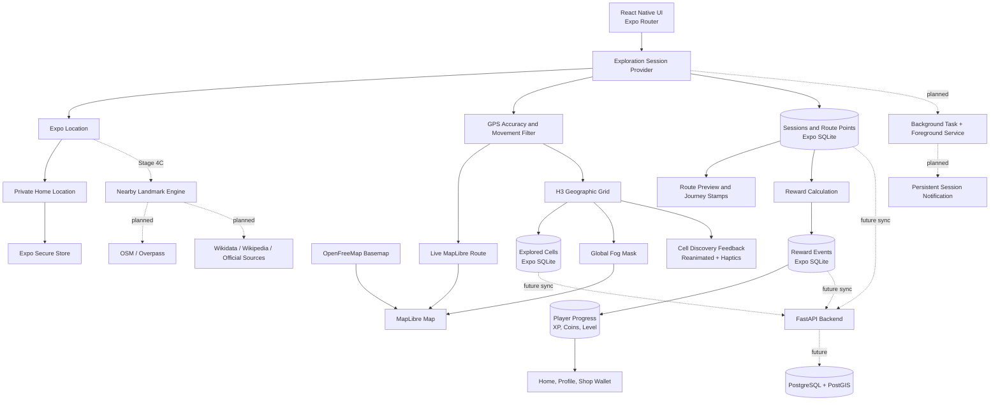

<div align="center">


# ARUKIYO

### Walk. Discover. Unlock the world.

**歩いて、世界をひらく。**

A Japanese-inspired mobile exploration game that turns real-world movement into progress, discovery, collections, and adventure.

[](#development-progress)
[](#android-build-variants)
[](#technology)
[](#technology)
[](LICENSE)

</div>

---

## About Arukiyo

Arukiyo is built around one simple idea:

> Leave the house, explore the real world, and gradually reveal your own map.

The application combines real-world walking, location-based discovery, Japanese-inspired visual design, persistent fog of war, journey tracking, progression, daily challenges, collectibles, and future social exploration.

Users begin from a private Home area and reveal new H3 cells as they move. The next landmark stages will turn museums, monuments, historic buildings, civic sites, cultural venues, and other important places into collectible discoveries with information, rewards, journal entries, source links, and future badges.

## Current experience

The current Android build includes:

- Home, Explore, Quests, Journal, Profile, Settings, Language, History, Summary, and Shop screens;
- real foreground GPS positioning;
- an encrypted private Home location stored locally;
- MapLibre rendering over an OpenFreeMap street/building basemap;
- OpenFreeMap Liberty as the primary style with Positron fallback;
- H3-based exploration cells at resolution 11;
- a global opaque fog mask that prevents zoom-out from revealing unexplored streets;
- a distinct known Home area that is visible without being counted as explored;
- permanent cut-outs for previously discovered cells, including cells far away from the current position;
- a 19-cell local Home area (`HOME_ZONE_RADIUS = 2`);
- current-cell, discovered-cell, Home-area, and route visual states;
- persistent discovered cells and exploration state in SQLite;
- foreground exploration sessions with accepted and filtered GPS points;
- session state preserved while navigating between Explore, History, and summaries;
- a live route line, distance, duration, GPS-point, and new-cell counters;
- GPS filtering for inaccurate, duplicated, stale, and implausible points;
- persistent session summaries, route points, and local history;
- real XP, coins, levels, ranks, and daily bonuses;
- duplicate-reward protection;
- animated discovery feedback with sakura petals;
- haptic feedback for discoveries, completed journeys, and Level Up;
- animated XP and coin totals for newly completed sessions;
- route previews with start and finish markers;
- Journey Stamps for meaningful session achievements;
- reduced-motion support;
- English, Romanian, Japanese, and device-language modes;
- a final Hanko Path — Sakura visual identity;
- separate Development, Preview, and Production application variants;
- a standalone Android Preview APK that runs without Metro.

## Core product vision

Arukiyo is planned as a real-world exploration RPG with:

- exploration percentages for Home area, neighbourhood, city, region, country, continent, and world;
- roads, buildings, neighbourhoods, and map areas revealed through real movement;
- collectible landmarks with history, rarity, rewards, and equippable badges;
- verified links to official sources, Wikipedia, Wikidata, or other trustworthy references where available;
- XP, levels, explorer ranks, coins, Sakura Shards, streaks, and achievements;
- daily, weekly, monthly, seasonal, and landmark-based missions;
- walking, discovery, history, photography, and travel progression paths;
- a cosmetic shop with themes, profile frames, map styles, companions, and effects;
- a Japanese stamp-book travel journal;
- optional friends, profiles, presence, teams, shared expeditions, and privacy-aware comparisons;
- route memories and generated travel postcards;
- offline-first exploration with later synchronization;
- future augmented-reality discovery features;
- background session tracking with explicit controls and visible Android session status;
- safety controls, accessibility, privacy, data deletion, and anti-cheat protection.

## Development progress

| Stage | Status | Scope |
| --- | ---: | --- |
| Stage 0 | ✅ Complete | Windows environment, Expo project, Android SDK, JDK 17, physical-device build |
| Stage 1A | ✅ Complete | Visual identity, tabs, Home, Quests, Journal, Profile, and Shop prototypes |
| Stage 2A | ✅ Complete | Foreground GPS, encrypted Home location, permissions, and location accuracy |
| Stage 2B | ✅ Complete | MapLibre, H3 cells, SQLite persistence, live exploration, and initial fog of war |
| Stage 2C | ✅ Complete | English-first localization, Romanian and Japanese, map polish, Home marker |
| Stage 3A | ✅ Complete | Persistent sessions, live route, GPS filtering, summaries, and history |
| Stage 3B | ✅ Complete | XP, levels, coins, reward rules, daily bonuses, dashboards, and wallet |
| Stage 3C | ✅ Complete | Discovery celebrations, haptics, animated rewards, route previews, Journey Stamps |
| Stage 3D | ✅ Complete | Hanko Path — Sakura brand, Android variants, EAS Preview APK, standalone field validation |
| Stage 4A | ✅ Complete | Active exploration session ownership moved above navigation so sessions survive normal screen changes |
| Stage 4B | ✅ Complete | Richer OpenFreeMap basemap, global opaque fog mask, known Home area, permanent discovered-cell reveal |
| Stage 4C1 | ⏭ Next | Nearby landmark acquisition, importance classification, normalized local cache, unlock eligibility |
| Stage 4C2 | Planned | Landmark map markers, proximity unlocks, discovery celebration, rewards, Sakura Shards |
| Stage 4C3 | Planned | Journal landmark collection, detail pages, history, quick facts, images, and source links |
| Stage 5 | Planned | Accounts, synchronization, backend, friends, presence, shared progress, teams |

> Arukiyo is under active development and is not yet a production release.

## Map and exploration model

Arukiyo converts GPS coordinates into H3 hexagonal cells. Entering a sufficiently accurate cell records it locally as discovered. During an active session, accepted GPS points form a persistent route.

| Map state | Meaning |
| --- | --- |
| Opaque ink fog | Unexplored world; basemap details are intentionally hidden |
| Matcha Home cells | Known Home area; visible but not automatically counted as explored |
| Sakura cells | Previously discovered territory |
| Gold cell | Current H3 cell |
| Green marker | Current GPS position |
| Vermilion Home marker | Private Home position in the local development UI |
| Vermilion route line | Accepted movement during the current session |

### Global fog of war

Stage 4B separates the fog system from the finite local H3 display.

A global polygon mask covers unexplored map content with fully opaque ink. Revealed Home, current, and discovered H3 polygons are cut out of the mask so the underlying street/building basemap is visible only where Arukiyo permits it.

This prevents a user from zooming out beyond a finite H3 ring and seeing unexplored roads, buildings, neighbourhood names, or points of interest.

Previously discovered H3 cells are included in the reveal collection even when they are far from the current GPS position. A journey in another city therefore does not cause earlier explored territory to become hidden again.

### Home area is known, not explored

The current Home zone uses H3 radius 2, creating 19 cells around the private starting point.

Home cells are visually readable from the beginning, but they do **not** enter the explored-cell database simply because they belong to the Home area. They only contribute to exploration completion after the user actually reaches and records them.

This keeps two concepts separate:

```text
known Home territory != explored territory
```

## Basemap

The Stage 4B development basemap uses OpenFreeMap:

- primary style: `https://tiles.openfreemap.org/styles/liberty`;
- fallback style: `https://tiles.openfreemap.org/styles/positron`.

The basemap provides street, building, neighbourhood, and POI context while the Arukiyo fog remains a separate game layer above it.

Map data and third-party styles remain subject to their own attribution and licensing requirements.

## Session tracking and GPS validation

Each accepted point can store coordinates, timestamp, accuracy, altitude, speed, heading, and route sequence.

A point can be filtered when:

- reported accuracy is worse than the configured threshold;
- it is too close to the previous accepted point;
- its timestamp is stale or invalid;
- the implied speed is implausible for walking exploration.

Filtered points do not increase route distance or create false route segments.

### Session continuity

Stage 4A moved active-session ownership into an application-level provider. Navigating from Explore to Session History or an older summary and then returning no longer destroys the active in-memory session state.

Distance, duration, route points, accepted/rejected GPS points, and newly discovered cells remain attached to the running session during normal navigation.

Background tracking is still intentionally separate and remains planned in issue #5.

## Stage 4C landmark roadmap

Stage 4C begins the landmark system.

### Stage 4C1 — Landmark Engine

The first landmark stage is planned to:

- request nearby candidate places from OpenStreetMap/Overpass or an equivalent OSM data path;
- consider tags such as `historic`, `heritage`, `tourism`, `museum`, `memorial`, civic/cultural buildings, `wikidata`, `wikipedia`, and official website fields;
- normalize nodes, ways, and relations into one Arukiyo landmark model;
- score candidates so ordinary apartment blocks, supermarkets, and routine businesses do not become collectible landmarks;
- cache nearby candidates locally in SQLite;
- store stable source identifiers and metadata needed for later enrichment;
- determine whether a candidate is eligible for proximity-based discovery.

### Stage 4C2 — Landmark Discovery

Planned discovery behaviour:

- a landmark becomes eligible only when the player physically approaches it with acceptable GPS quality;
- large buildings can use geometry-aware distance instead of requiring the user to reach an arbitrary centre point;
- successful discovery triggers Arukiyo visual feedback and haptics;
- the discovery is persisted once and cannot be rewarded repeatedly;
- landmark rewards can include XP, coins, Journey Stamps, and the first implementation of Sakura Shards.

### Stage 4C3 — Journal and historical information

Discovered landmarks are planned to appear in the Journal with:

- name, category, location, rarity/importance, and discovery date;
- photograph where a licensed/reusable source is available;
- concise overview;
- detailed history and quick facts when reliable source data exists;
- discovery-session information;
- official website link where available;
- Wikipedia/Wikidata links when present;
- clear source attribution.

Arukiyo should prefer factual source-backed landmark content rather than inventing historical details when trustworthy sources are unavailable.

## Progression and currencies

### XP and coins

| Activity | XP | Coins |
| --- | ---: | ---: |
| Every validated 50 m | 1 | — |
| Every validated 250 m | — | 1 |
| Every newly discovered H3 cell | 10 | 2 |
| Meaningful completed session | 5 | 1 |
| First meaningful completed session of the day | 25 | 5 |
| First completed session of at least 1 km that day | 50 | 10 |

A meaningful completed session contains at least 50 metres of validated movement or at least one newly discovered cell.

Every rewarded session receives one unique reward event, so opening the same summary again cannot grant the reward twice.

### Sakura Shards — planned for Stage 4C

Sakura Shards will be a rarer exploration currency, separate from ordinary coins.

Planned sources include:

- major landmark discoveries;
- completed city or regional collections;
- important distance and level milestones;
- weekly, monthly, and seasonal quest chains;
- long exploration streaks;
- limited exploration events.

Coins will primarily unlock common cosmetics. Sakura Shards will unlock rarer themes, animated frames, companions, special map effects, and seasonal items. The initial design keeps Sakura Shards earnable through exploration rather than direct payment.

## Levels and ranks

Level 1 requires 100 XP to advance. Each later level requires 75 more XP than the previous level.

| Levels | Explorer rank |
| --- | --- |
| 1–4 | Wanderer |
| 5–9 | Pathfinder |
| 10–19 | Trailblazer |
| 20–34 | Voyager |
| 35+ | World Walker |

Rank names are localized in English, Romanian, and Japanese.

## Android build variants

| Variant | Name | Android package | Purpose |
| --- | --- | --- | --- |
| Development | Arukiyo Dev | `com.eduarddonea.arukiyo.dev` | Fast development through Metro and Expo Dev Client |
| Preview | Arukiyo Preview | `com.eduarddonea.arukiyo.preview` | Standalone APK for real-device and outdoor testing |
| Production | Arukiyo | `com.eduarddonea.arukiyo` | Future Play Store release |

Development and Preview can remain installed on the same Android device.

The Preview profile uses EAS internal distribution and managed Android credentials. The standalone Preview APK has been tested without depending on Metro.

## Hanko Path — Sakura identity

The selected brand combines:

- a vermilion circular seal inspired by a Japanese hanko;
- a walking path that forms the letter **A**;
- a destination sun near the upper-right edge;
- one restrained sakura blossom;
- ink green, paper cream, vermilion, sakura pink, and warm gold.

Included assets include Android launcher/adaptive/monochrome icons, splash marks, wordmarks, the standalone brand mark, and the brand brief.

## Background exploration roadmap

Background tracking is intentionally not enabled yet. The open roadmap item is [#5 — Add background exploration with persistent session notification](https://github.com/EdisonSenpai/Arukiyo/issues/5).

The planned Android experience includes:

- explicit user opt-in;
- a persistent foreground-service notification while a session is active;
- live duration and distance in the notification;
- tap to return directly to the active session;
- an action to stop and finalize the session;
- recovery after UI/process recreation;
- clear permission and battery-use explanations;
- no background location sharing by default.

## Future social layer

Stage 5 is planned to add:

- account registration and login;
- FastAPI, PostgreSQL, and PostGIS synchronization;
- friend requests and friend profiles;
- optional online/activity status;
- privacy-controlled level, distance, discoveries, badges, and collection progress;
- group expeditions and team goals;
- optional comparisons and leaderboards;
- synchronization between Development, Preview, and future production installs.

## Languages

Arukiyo currently provides:

- **English** as the default language;
- **Romanian**;
- **Japanese**;
- **Use device language** when the Android language is supported.

The selected language is stored locally and restored when the application is reopened.

## Technology

| Area | Technology |
| --- | --- |
| Mobile application | React Native 0.86 + TypeScript |
| Development platform | Expo SDK 57 + Expo Router |
| Android build | Android SDK 36, Gradle, JDK 17 |
| Standalone builds | EAS Build internal distribution |
| Map rendering | MapLibre React Native |
| Basemap styles | OpenFreeMap Liberty + Positron fallback |
| Geographic grid | H3 |
| Local structured storage | Expo SQLite |
| Sensitive local storage | Expo Secure Store |
| Foreground location | Expo Location |
| Motion and feedback | React Native Reanimated + Expo Haptics |
| Localization | i18next + react-i18next + Expo Localization |
| Planned landmark data | OpenStreetMap / Overpass, Wikidata, Wikimedia/Wikipedia, official sources |
| Planned background execution | Expo Location + Expo Task Manager + Android foreground service |
| Planned notifications | Expo Notifications and Android notification actions |
| Planned backend | FastAPI |
| Planned database | PostgreSQL + PostGIS |
| Planned caching/tasks | Redis |

## Architecture



## Repository structure

```text
Arukiyo/
├── assets/                  Launcher, adaptive, splash, and interface assets
├── docs/
│   └── brand/               Hanko Path — Sakura identity files
├── scripts/                 Build, variant, and compatibility helpers
├── src/
│   ├── app/                 Expo Router screens, dashboards, history, summaries
│   ├── components/          MapLibre, fog, celebrations, counters, interface pieces
│   ├── constants/           Theme, exploration, and progression configuration
│   ├── hooks/               Exploration, progression, and accessibility state
│   ├── i18n/                English, Romanian, and Japanese resources
│   ├── lib/                 H3, SQLite, fog geometry, GPS filtering, rewards, haptics
│   └── providers/           Application-level state providers
├── app.config.js            Development, Preview, and Production variant identity
├── app.json                 Shared Expo configuration and EAS project link
├── eas.json                 EAS build profiles
├── package.json             Dependencies and project commands
└── README.md
```

The native `android/` and `ios/` directories are generated locally and intentionally excluded from Git.

## Development setup

### Requirements

- Windows 11;
- Node.js 24 LTS;
- npm 11 or newer;
- JDK 17;
- Android Studio;
- Android SDK Platform 36 and Build Tools 36;
- an Android physical device or emulator.

### Install dependencies

```powershell
npm install
```

### Inspect a build variant

```powershell
powershell -ExecutionPolicy Bypass `
  -File .\scripts\show-app-variant.ps1 `
  -Variant development
```

Supported values are `development`, `preview`, and `production`.

### Prepare and install Arukiyo Dev

```powershell
powershell -ExecutionPolicy Bypass `
  -File .\scripts\prepare-development-variant.ps1

npx expo run:android --device
npm run dev
```

### Build the standalone Preview APK

```powershell
npx eas-cli@latest login

powershell -ExecutionPolicy Bypass `
  -File .\scripts\build-preview.ps1
```

## Stage 4B validation

Stage 4B has been tested on the Android development build with the following checks:

- OpenFreeMap streets/buildings render beneath the Arukiyo exploration layer;
- Home, discovered, current, and fog states remain visually distinct;
- unexplored territory becomes fully opaque instead of exposing the basemap;
- zooming out does not reveal streets beyond the explored/known cut-outs;
- the Home area uses 19 known cells while exploration completion still depends on actual discovered cells;
- previously discovered cells remain revealable even when not part of the current local H3 ring;
- `npm run typecheck` passes;
- `npm run lint` passes;
- `npx expo-doctor` reports 20/20 checks passed;
- `git diff --check` passes.

A non-blocking MapLibre native warning (`Invalid geometry in line layer`) can currently appear during map rendering even though the map remains functional and all project validation checks pass. It remains under observation for a later geometry/rendering cleanup if it becomes visually significant.

## Screenshot gallery

Privacy-safe gallery composites are prepared from real Android screenshots. Explore screenshots containing the exact private Home marker are intentionally excluded from public repository documentation.

Planned public panels include:

- Home progression, Quests, and Journal;
- Profile, route summary, rewards, and Journey Stamps;
- privacy-safe fog-of-war and future landmark-discovery views.

## Privacy and safety principles

- Home is sensitive information;
- exact Home coordinates are encrypted locally;
- public interfaces will use an approximate Home area;
- Home visibility on the development map must not imply public sharing;
- background tracking will require explicit opt-in;
- an active background session will remain visibly indicated;
- live location sharing will never be enabled by default;
- private property and unsafe areas must not become mandatory objectives;
- landmark discovery must not encourage trespassing or unsafe access;
- users will be able to delete local exploration and location data.

## Known development notes

- Background exploration and the persistent Android session notification remain planned in issue #5.
- The current OpenFreeMap styles are suitable for development but map-provider/licensing/availability decisions must be reviewed before production release.
- MapLibre may currently emit a non-blocking `Invalid geometry in line layer` warning during map rendering.
- GPS and reward thresholds are development values and require additional field tuning.
- Shop prices and wallet visibility are connected, but purchases, inventory, and Sakura Shards are not implemented yet.
- Landmark discovery, historical content, collections, and source enrichment begin in Stage 4C.
- `h3-js` needs a Hermes compatibility patch applied automatically after `npm install`.
- Gradle is pinned to Java 17 through the project helper script.
- Do not run `npm audit fix --force` without reviewing Expo and React Native compatibility.

## Contributing

Arukiyo is currently developed as a focused personal project. Issues and implementation discussions may be opened as it moves toward public testing.

Please do not submit large architectural changes without prior discussion, because the mobile, geographic, progression, landmark, notification, and backend systems are introduced incrementally by stage.

## Author

**Eduard Donea** — [EdisonSenpai](https://github.com/EdisonSenpai)

## License

Arukiyo is released under the [MIT License](LICENSE).

Third-party frameworks, libraries, map data, fonts, icons, and other assets remain subject to their respective licenses and attribution requirements.

---

<div align="center">

**Arukiyo — your world begins one step from home.**

</div>
