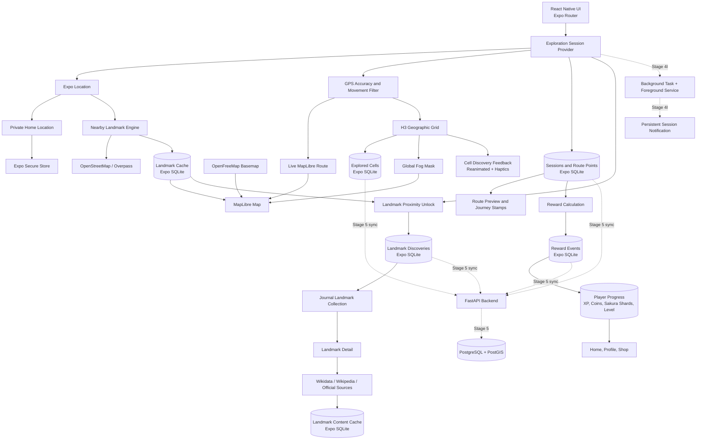

<div align="center">


# ARUKIYO

### Walk. Discover. Unlock the world.

**歩いて、世界をひらく。**

A Japanese-inspired mobile exploration game that turns real-world movement into progress, discovery, collections, and adventure.

[](#development-progress)
[](#android-build-variants)
[](#technology)
[](#technology)
[](LICENSE)

</div>

---

## About Arukiyo

Arukiyo is built around one simple idea:

> Leave the house, explore the real world, and gradually reveal your own map.

The application combines real-world walking, location-based discovery, Japanese-inspired visual design, persistent fog of war, journey tracking, progression, collectible landmarks, a travel journal, and future social exploration.

Users begin from a private Home area and reveal new H3 cells as they move. Stage 4C turns museums, monuments, historic buildings, cultural venues, religious sites, civic places, and other important locations into real exploration targets that can be discovered, rewarded, and saved to the Journal.

## Current experience

The current Android build includes:

- Home, Explore, Quests, Journal, Profile, Settings, Language, History, Summary, Shop, and Landmark Detail screens;
- real foreground GPS positioning;
- an encrypted private Home location stored locally;
- MapLibre rendering over an OpenFreeMap street/building basemap;
- OpenFreeMap Liberty as the primary style with Positron fallback;
- H3-based exploration cells at resolution 11;
- a global opaque fog mask that prevents zoom-out from revealing unexplored streets;
- a distinct known Home area that is visible without being counted as explored;
- permanent cut-outs for previously discovered cells, including cells far away from the current position;
- a 19-cell local Home area (`HOME_ZONE_RADIUS = 2`);
- current-cell, discovered-cell, Home-area, route, and landmark visual states;
- persistent discovered cells and exploration state in SQLite;
- foreground exploration sessions with accepted and filtered GPS points;
- session state preserved while navigating between Explore, History, summaries, Journal, and other screens;
- a live route line, distance, duration, GPS-point, and new-cell counters;
- GPS filtering for inaccurate, duplicated, stale, and implausible points;
- persistent session summaries, route points, and local history;
- real XP, coins, levels, ranks, and daily bonuses;
- duplicate-reward protection;
- animated discovery feedback with sakura petals;
- haptic feedback for discoveries, completed journeys, Level Up, and landmark discovery;
- route previews with start and finish markers;
- Journey Stamps for meaningful session achievements;
- nearby landmark acquisition from OpenStreetMap/Overpass;
- normalized local landmark cache and importance scoring;
- map landmark targets with visual spacing and prioritization;
- proximity-based landmark unlock rules;
- landmark rewards including XP, coins, and Sakura Shards;
- landmark discovery persistence that prevents duplicate rewards;
- a Journal landmark collection backed by real local discoveries;
- landmark detail pages with discovery metadata, quick facts, rewards, and source links;
- source-backed enrichment through Wikipedia/Wikidata where available;
- a local 30-day landmark-content cache;
- reduced-motion support;
- English, Romanian, Japanese, and device-language modes;
- a final Hanko Path — Sakura visual identity;
- separate Development, Preview, and Production application variants;
- a standalone Android Preview APK profile that runs without Metro.

## Core product vision

Arukiyo is planned as a real-world exploration RPG with:

- exploration percentages for Home area, neighbourhood, city, region, country, continent, and world;
- roads, buildings, neighbourhoods, and map areas revealed through real movement;
- collectible landmarks with history, rarity, rewards, and equippable badges;
- verified links to official sources, Wikipedia, Wikidata, or other trustworthy references where available;
- XP, levels, explorer ranks, coins, Sakura Shards, streaks, and achievements;
- daily, weekly, monthly, seasonal, and landmark-based missions;
- walking, discovery, history, photography, and travel progression paths;
- a cosmetic shop with themes, profile frames, map styles, companions, and effects;
- a Japanese stamp-book travel journal and world atlas;
- optional friends, profiles, presence, teams, shared expeditions, and privacy-aware comparisons;
- route memories and generated travel postcards;
- offline-first exploration with later synchronization;
- future augmented-reality discovery features;
- background session tracking with explicit controls and visible Android session status;
- safety controls, accessibility, privacy, data deletion, and anti-cheat protection.

## Development progress

| Stage | Status | Scope |
| --- | ---: | --- |
| Stage 0 | ✅ Complete | Windows environment, Expo project, Android SDK, JDK 17, physical-device build |
| Stage 1A | ✅ Complete | Visual identity, tabs, Home, Quests, Journal, Profile, and Shop prototypes |
| Stage 2A | ✅ Complete | Foreground GPS, encrypted Home location, permissions, and location accuracy |
| Stage 2B | ✅ Complete | MapLibre, H3 cells, SQLite persistence, live exploration, and initial fog of war |
| Stage 2C | ✅ Complete | English-first localization, Romanian and Japanese, map polish, Home marker |
| Stage 3A | ✅ Complete | Persistent sessions, live route, GPS filtering, summaries, and history |
| Stage 3B | ✅ Complete | XP, levels, coins, reward rules, daily bonuses, dashboards, and wallet |
| Stage 3C | ✅ Complete | Discovery celebrations, haptics, animated rewards, route previews, Journey Stamps |
| Stage 3D | ✅ Complete | Hanko Path — Sakura brand, Android variants, EAS Preview APK, standalone field validation |
| Stage 4A | ✅ Complete | Active exploration session ownership above navigation so sessions survive normal screen changes |
| Stage 4B | ✅ Complete | Richer basemap, global opaque fog mask, known Home area, permanent discovered-cell reveal |
| Stage 4C1 | ✅ Complete | Nearby landmark acquisition, importance classification, normalized local cache, unlock eligibility |
| Stage 4C2 | ✅ Complete | Landmark map targets, proximity unlocks, discovery feedback, rewards, Sakura Shards foundation |
| Stage 4C3 | ✅ Complete | Journal landmark collection, detail pages, quick facts, images, Wikipedia/Wikidata/source enrichment |
| Stage 4D | ✅ Complete | Sakura Shards UI, dual wallet, economy explanation, reward-surface integration |
| Stage 4E | ⏭ Next | World Atlas, city mastery, region/country/continent/world progress, city reveal |
| Stage 4F | Planned | Dynamic Daily / Weekly / Monthly Quest Engine, persistence, timers, contextual mission generation |
| Stage 4G | Planned | Real Shop purchases, inventory, ownership, equip state, functional cosmetics |
| Stage 4H | Planned | Profile badges, Journal Stamps/Collections, richer explorer statistics and mastery displays |
| Stage 4I | Planned | Background exploration, Android foreground service, persistent session notification |
| Stage 4J | Planned | Offline/field hardening, performance, migrations, Preview field validation, Stage 4 release |
| Stage 5 | Planned | Accounts, synchronization, backend, friends, presence, shared progress, teams |

> Arukiyo is under active development and is not yet a production release.

## Map and exploration model

Arukiyo converts GPS coordinates into H3 hexagonal cells. Entering a sufficiently accurate cell records it locally as discovered. During an active session, accepted GPS points form a persistent route.

| Map state | Meaning |
| --- | --- |
| Opaque ink fog | Unexplored world; basemap details are intentionally hidden |
| Matcha Home cells | Known Home area; visible but not automatically counted as explored |
| Sakura cells | Previously discovered territory |
| Gold cell | Current H3 cell |
| Green marker | Current GPS position |
| Vermilion Home marker | Private Home position in the local development UI |
| Vermilion route line | Accepted movement during the current session |
| Gold landmark pin | Eligible exploration target not yet discovered |
| Vermilion landmark pin | Landmark already discovered |

### Global fog of war

Stage 4B separates the fog system from the finite local H3 display.

A global polygon mask covers unexplored map content with fully opaque ink. Revealed Home, current, and discovered H3 polygons are cut out of the mask so the underlying street/building basemap is visible only where Arukiyo permits it.

This prevents a user from zooming out beyond a finite H3 ring and seeing unexplored roads, buildings, neighbourhood names, or points of interest.

Previously discovered H3 cells are included in the reveal collection even when they are far from the current GPS position. A journey in another city therefore does not cause earlier explored territory to become hidden again.

### Home area is known, not explored

The current Home zone uses H3 radius 2, creating 19 cells around the private starting point.

Home cells are visually readable from the beginning, but they do **not** enter the explored-cell database simply because they belong to the Home area. They only contribute to exploration completion after the user actually reaches and records them.

This keeps two concepts separate:

```text
known Home territory != explored territory
```

The same distinction will later support city mastery:

```text
charted territory != physically explored territory
```

## Basemap

The current development basemap uses OpenFreeMap:

- primary style: `https://tiles.openfreemap.org/styles/liberty`;
- fallback style: `https://tiles.openfreemap.org/styles/positron`.

The basemap provides street, building, neighbourhood, and POI context while the Arukiyo fog remains a separate game layer above it.

Map data and third-party styles remain subject to their own attribution and licensing requirements.

## Session tracking and GPS validation

Each accepted point can store coordinates, timestamp, accuracy, altitude, speed, heading, and route sequence.

A point can be filtered when:

- reported accuracy is worse than the configured threshold;
- it is too close to the previous accepted point;
- its timestamp is stale or invalid;
- the implied speed is implausible for walking exploration.

Filtered points do not increase route distance or create false route segments.

### Session continuity

Stage 4A moved active-session ownership into an application-level provider. Navigating from Explore to Session History, Journal, another tab, or an older summary and then returning no longer destroys the active in-memory session state.

Distance, duration, route points, accepted/rejected GPS points, and newly discovered cells remain attached to the running session during normal navigation.

Background tracking is intentionally separate and remains planned for Stage 4I / issue #5.

## Stage 4C landmark system

Stage 4C introduces the first complete landmark loop.

### Stage 4C1 — Landmark Engine

The landmark engine:

- queries nearby candidate places from OpenStreetMap/Overpass;
- considers tags such as `historic`, `heritage`, `tourism`, `museum`, `memorial`, civic/cultural buildings, `wikidata`, `wikipedia`, and official website fields;
- normalizes OSM nodes, ways, and relations into one Arukiyo landmark model;
- scores candidates so ordinary routine places do not automatically become collectible landmarks;
- caches candidates locally in SQLite;
- stores stable OSM source identifiers and metadata needed for enrichment;
- separates raw candidates, cached candidates, and eligible collectible landmarks.

### Stage 4C2 — Landmark Discovery

Eligible landmarks become visible as exploration targets over the fog-of-war map.

Current discovery behaviour includes:

- map-pin prioritization and spacing to avoid dense marker piles;
- a primary nearby target with distance feedback;
- proximity unlock at approximately 60 metres;
- GPS-quality gating before an unlock can occur;
- discovery only while an exploration session is active;
- persistent unlock records linked to the exploration session;
- duplicate-unlock protection;
- discovery haptics and visual feedback;
- tier-based rewards;
- XP, coins, and Sakura Shards saved directly into progression storage.

Current development reward values:

| Landmark tier | XP | Coins | Sakura Shards |
| --- | ---: | ---: | ---: |
| Local | 25 | 5 | 1 |
| Notable | 50 | 10 | 2 |
| Major | 90 | 18 | 3 |
| Iconic | 150 | 30 | 5 |

These values are development balancing values and may change after field testing.

### Stage 4C3 — Journal and source-backed information

Discovered landmarks appear in the Journal and open into a dedicated detail page containing the information available for that discovery:

- name, category, importance tier, and discovery date;
- discovery distance and GPS accuracy;
- associated journey distance and duration where available;
- rewards earned at discovery time;
- quick facts derived from stored source tags;
- photograph preview when a linked reusable Wikipedia/Wikimedia source exposes one;
- concise source-backed summary when Wikipedia/Wikidata can resolve the landmark;
- official website link where available;
- Wikipedia, Wikidata, and OpenStreetMap links when available;
- local content caching to avoid unnecessary repeated requests.

Arukiyo deliberately does **not** invent historical details when trustworthy source-backed content cannot be resolved. The detail page falls back to available metadata and source links instead.

### Stage 4C validation status

Stage 4C has passed the current development validation suite:

- `npm run typecheck` passes;
- `npm run lint` passes;
- `npx expo-doctor` reports 20/20 checks passed;
- `git diff --check` passes;
- Expo Router recognizes `/landmark-detail`;
- landmark candidates have been resolved from a real Bucharest-area Overpass scan;
- landmark map pins and candidate prioritization have been visually validated on the Android development build;
- the new Journal empty state and landmark collection structure have been visually validated.

The complete outdoor path — approach a real landmark, trigger proximity unlock, receive the rewards, reopen it from Journal, and validate live source enrichment — remains an explicit Preview/field-validation item before the final Stage 4 release. This does not block Stage 4D development.

## Progression and currencies

### XP and coins

| Activity | XP | Coins |
| --- | ---: | ---: |
| Every validated 50 m | 1 | — |
| Every validated 250 m | — | 1 |
| Every newly discovered H3 cell | 10 | 2 |
| Meaningful completed session | 5 | 1 |
| First meaningful completed session of the day | 25 | 5 |
| First completed session of at least 1 km that day | 50 | 10 |

A meaningful completed session contains at least 50 metres of validated movement or at least one newly discovered cell.

Every rewarded session receives one unique reward event, so opening the same summary again cannot grant the reward twice.

### Sakura Shards

Stage 4C introduces the **storage and reward foundation** for Sakura Shards as a rarer exploration currency separate from ordinary coins.

The first implemented earning source is proximity-based landmark discovery, with rewards scaled by landmark importance tier.

Stage 4D makes Sakura Shards visible throughout the application through a dual-wallet UI and a clear explanation of how the currency is earned and used.

Planned additional sources include:

- completed city or regional mastery;
- important distance and level milestones;
- weekly, monthly, and seasonal quest chains;
- long exploration streaks;
- landmark and regional collections;
- limited exploration events.

Coins will primarily unlock common cosmetics. Sakura Shards are intended for rarer themes, animated frames, companions, special map effects, collections, and seasonal items. The current product direction keeps Sakura Shards earnable through exploration rather than direct payment.

## Stage 4 roadmap before accounts

Stage 5 will not begin until Arukiyo is a coherent local single-player exploration game.

### Stage 4D — Economy UX

- dual Coins / Sakura Shards wallet;
- Sakura Shards on Home, Profile, Shop, and reward surfaces;
- clear `How to earn` explanation;
- reusable currency components for later quests, mastery, and shop purchases.

### Stage 4E — World Atlas and city mastery

The Atlas will organize exploration hierarchically:

```text
City
  ↓
Region / County
  ↓
Country
  ↓
Continent
  ↓
World
```

City mastery should use a weighted model rather than requiring every square metre to be walked. Planned signals include landmark mastery, representative exploration sectors, and journey depth. Unsafe, inaccessible, private, water, motorway, railway, airport, and similar areas must not become mandatory walking objectives.

Completing a city can unlock a charted-city state while keeping physically explored cells distinct from merely revealed territory.

### Stage 4F — Dynamic Quest Engine

Daily, weekly, and monthly quests will be generated from real player state and persisted until their expiry time.

Mission generation will consider level, recent activity, reachable nearby content, discovered cells, landmarks, cities visited, streaks, and distance history. A quest must remain realistically completable without requiring travel expenditure or access to unavailable landmarks.

### Stage 4G — Real Shop

The current preview catalog will become a functional local economy with purchases, inventory, ownership, equip state, and cosmetics that visibly change the application.

### Stage 4H — Profile, badges, Stamps, and Collections

The Profile and Journal will connect exploration statistics, city mastery, achievements, equippable badges, Journey Stamps, themed landmark collections, and world progression.

### Stage 4I — Background exploration

Background tracking will require explicit opt-in and a persistent Android foreground-service notification while an exploration session remains active.

### Stage 4J — Field and release hardening

The final Stage 4 pass will cover offline behaviour, map/API failures, location quality, migrations, process recovery, battery usage, field testing, performance, privacy, Preview APK validation, repository cleanup, documentation, and release preparation.

## Levels and ranks

Level 1 requires 100 XP to advance. Each later level requires 75 more XP than the previous level.

| Levels | Explorer rank |
| --- | --- |
| 1–4 | Wanderer |
| 5–9 | Pathfinder |
| 10–19 | Trailblazer |
| 20–34 | Voyager |
| 35+ | World Walker |

Rank names are localized in English, Romanian, and Japanese.

## Android build variants

| Variant | Name | Android package | Purpose |
| --- | --- | --- | --- |
| Development | Arukiyo Dev | `com.eduarddonea.arukiyo.dev` | Fast development through Metro and Expo Dev Client |
| Preview | Arukiyo Preview | `com.eduarddonea.arukiyo.preview` | Standalone APK for real-device and outdoor testing |
| Production | Arukiyo | `com.eduarddonea.arukiyo` | Future Play Store release |

Development and Preview can remain installed on the same Android device.

The Preview profile uses EAS internal distribution and managed Android credentials. A standalone Preview APK can run without depending on Metro.

## Hanko Path — Sakura identity

The selected brand combines:

- a vermilion circular seal inspired by a Japanese hanko;
- a walking path that forms the letter **A**;
- a destination sun near the upper-right edge;
- one restrained sakura blossom;
- ink green, paper cream, vermilion, sakura pink, and warm gold.

Included assets include Android launcher/adaptive/monochrome icons, splash marks, wordmarks, the standalone brand mark, and the brand brief.

## Background exploration roadmap

Background tracking is intentionally not enabled yet. The open roadmap item is [#5 — Add background exploration with persistent session notification](https://github.com/EdisonSenpai/Arukiyo/issues/5).

The planned Android experience includes:

- explicit user opt-in;
- a persistent foreground-service notification while a session is active;
- live duration and distance in the notification;
- tap to return directly to the active session;
- an action to stop and finalize the session;
- recovery after UI/process recreation;
- clear permission and battery-use explanations;
- no background location sharing by default.

## Future social layer

Stage 5 is planned to add:

- account registration and login;
- FastAPI, PostgreSQL, and PostGIS synchronization;
- friend requests and friend profiles;
- optional online/activity status;
- privacy-controlled level, distance, discoveries, badges, and collection progress;
- group expeditions and team goals;
- optional comparisons and leaderboards;
- synchronization between Development, Preview, and future production installs.

## Languages

Arukiyo currently provides:

- **English** as the default language;
- **Romanian**;
- **Japanese**;
- **Use device language** when the Android language is supported.

The selected language is stored locally and restored when the application is reopened.

## Technology

| Area | Technology |
| --- | --- |
| Mobile application | React Native 0.86 + TypeScript |
| Development platform | Expo SDK 57 + Expo Router |
| Android build | Android SDK 36, Gradle, JDK 17 |
| Standalone builds | EAS Build internal distribution |
| Map rendering | MapLibre React Native |
| Basemap styles | OpenFreeMap Liberty + Positron fallback |
| Geographic grid | H3 |
| Local structured storage | Expo SQLite |
| Sensitive local storage | Expo Secure Store |
| Foreground location | Expo Location |
| Motion and feedback | React Native Reanimated + Expo Haptics |
| Localization | i18next + react-i18next + Expo Localization |
| Landmark discovery data | OpenStreetMap / Overpass |
| Landmark enrichment | Wikidata, Wikimedia/Wikipedia, official source links |
| Planned background execution | Expo Location + Expo Task Manager + Android foreground service |
| Planned notifications | Expo Notifications and Android notification actions |
| Planned backend | FastAPI |
| Planned database | PostgreSQL + PostGIS |
| Planned caching/tasks | Redis |

## Architecture


```mermaid
flowchart TD
    UI[React Native UI\nExpo Router] --> SESSION[Exploration Session Provider]
    SESSION --> GPS[Expo Location]
    SESSION --> FILTER[GPS Accuracy and Movement Filter]
    FILTER --> ROUTE[Live MapLibre Route]
    FILTER --> GRID[H3 Geographic Grid]
    GRID --> CELLS[(Explored Cells\nExpo SQLite)]
    GRID --> MASK[Global Fog Mask]
    BASE[OpenFreeMap Basemap] --> MAP[MapLibre Map]
    MASK --> MAP
    ROUTE --> MAP
    GRID --> DISCOVERY[Cell Discovery Feedback\nReanimated + Haptics]
    SESSION --> SESSIONS[(Sessions and Route Points\nExpo SQLite)]
    SESSIONS --> SUMMARY[Route Preview and Journey Stamps]
    SESSIONS --> REWARDS[Reward Calculation]
    REWARDS --> EVENTS[(Reward Events\nExpo SQLite)]
    EVENTS --> PLAYER[(Player Progress\nXP, Coins, Sakura Shards, Level)]
    PLAYER --> DASH[Home, Profile, Shop]
    GPS --> HOME[Private Home Location]
    HOME --> SECURE[Expo Secure Store]
    GPS --> LANDMARKS[Nearby Landmark Engine]
    LANDMARKS --> OVERPASS[OpenStreetMap / Overpass]
    LANDMARKS --> LCACHE[(Landmark Cache\nExpo SQLite)]
    LCACHE --> MAP
    SESSION --> UNLOCK[Landmark Proximity Unlock]
    LCACHE --> UNLOCK
    UNLOCK --> LDISC[(Landmark Discoveries\nExpo SQLite)]
    LDISC --> JOURNAL[Journal Landmark Collection]
    JOURNAL --> DETAIL[Landmark Detail]
    DETAIL --> SOURCES[Wikidata / Wikipedia / Official Sources]
    SOURCES --> CONTENT[(Landmark Content Cache\nExpo SQLite)]
    SESSION -. Stage 4I .-> BG[Background Task + Foreground Service]
    BG -. Stage 4I .-> NOTICE[Persistent Session Notification]
    CELLS -. Stage 5 sync .-> API[FastAPI Backend]
    SESSIONS -. Stage 5 sync .-> API
    EVENTS -. Stage 5 sync .-> API
    LDISC -. Stage 5 sync .-> API
    API -. Stage 5 .-> POSTGIS[(PostgreSQL + PostGIS)]
```

## Repository structure

```text
Arukiyo/
├── assets/                  Launcher, adaptive, splash, and interface assets
├── docs/
│   └── brand/               Hanko Path — Sakura identity files
├── scripts/                 Build, variant, and compatibility helpers
├── src/
│   ├── app/                 Expo Router screens, dashboards, journal, details, history
│   ├── components/          MapLibre, landmark pins, celebrations, counters, UI pieces
│   ├── constants/           Theme, exploration, progression, landmark configuration
│   ├── hooks/               Exploration, progression, landmark, accessibility state
│   ├── i18n/                English, Romanian, Japanese, landmark resources
│   ├── lib/                 H3, SQLite, fog, GPS, rewards, landmarks, source enrichment
│   └── providers/           Application-level state providers
├── app.config.js            Development, Preview, and Production variant identity
├── app.json                 Shared Expo configuration and EAS project link
├── eas.json                 EAS build profiles
├── package.json             Dependencies and project commands
└── README.md
```

The native `android/` and `ios/` directories are generated locally and intentionally excluded from Git.

## Development setup

### Requirements

- Windows 11;
- Node.js 24 LTS;
- npm 11 or newer;
- JDK 17;
- Android Studio;
- Android SDK Platform 36 and Build Tools 36;
- an Android physical device or emulator.

### Install dependencies

```powershell
npm install
```

### Inspect a build variant

```powershell
powershell -ExecutionPolicy Bypass `
  -File .\scripts\show-app-variant.ps1 `
  -Variant development
```

Supported values are `development`, `preview`, and `production`.

### Prepare and install Arukiyo Dev

```powershell
powershell -ExecutionPolicy Bypass `
  -File .\scripts\prepare-development-variant.ps1

npx expo run:android --device
npm run dev
```

### Build the standalone Preview APK

```powershell
npx eas-cli@latest login

powershell -ExecutionPolicy Bypass `
  -File .\scripts\build-preview.ps1
```

## Validation

The current branch has passed the development validation commands used throughout the project:

- `npm run typecheck`;
- `npm run lint`;
- `npx expo-doctor` → 21/21 checks passed;
- `git diff --check`.

A non-blocking MapLibre native warning (`Invalid geometry in line layer`) can currently appear during map rendering even though the map remains functional and the project validation checks pass. It remains under observation for Stage 4J geometry/rendering cleanup if needed.

## Screenshot gallery

Privacy-safe gallery composites are prepared from real Android screenshots. Explore screenshots containing the exact private Home marker are intentionally excluded from public repository documentation.

Planned public panels include:

- Home progression, Quests, and Journal;
- Profile, route summary, rewards, and Journey Stamps;
- privacy-safe fog-of-war and landmark-discovery views;
- World Atlas and city mastery after Stage 4E.

## Privacy and safety principles

- Home is sensitive information;
- exact Home coordinates are encrypted locally;
- public interfaces will use an approximate Home area;
- Home visibility on the development map must not imply public sharing;
- background tracking will require explicit opt-in;
- an active background session will remain visibly indicated;
- live location sharing will never be enabled by default;
- private property and unsafe areas must not become mandatory objectives;
- landmark discovery must not encourage trespassing or unsafe access;
- city mastery must not require inaccessible, dangerous, private, motorway, railway, airport, or water-area exploration;
- users will be able to delete local exploration and location data.

## Known development notes

- Stage 4C code is complete, but its full outdoor landmark-unlock/source-enrichment flow still requires Preview field validation before the final Stage 4 release.
- Background exploration and the persistent Android session notification remain planned in issue #5 / Stage 4I.
- The current OpenFreeMap styles are suitable for development but map-provider/licensing/availability decisions must be reviewed before production release.
- MapLibre may currently emit a non-blocking `Invalid geometry in line layer` warning during map rendering.
- GPS, landmark, and reward thresholds are development values and require additional field tuning.
- Sakura Shards are persisted and awarded by landmark discovery, but full wallet visibility and economy explanation arrive in Stage 4D.
- The current Shop catalog is still a visual preview; real purchases, inventory, ownership, and equip state arrive in Stage 4G.
- The current Quests screen remains a prototype; persistent generated Daily/Weekly/Monthly missions arrive in Stage 4F.
- `h3-js` needs a Hermes compatibility patch applied automatically after `npm install`.
- Gradle is pinned to Java 17 through the project helper script.
- Do not run `npm audit fix --force` without reviewing Expo and React Native compatibility.

## Contributing

Arukiyo is currently developed as a focused personal project. Issues and implementation discussions may be opened as it moves toward public testing.

Please do not submit large architectural changes without prior discussion, because the mobile, geographic, progression, landmark, economy, notification, and backend systems are introduced incrementally by stage.

## Author

**Eduard Donea** — [EdisonSenpai](https://github.com/EdisonSenpai)

## License

Arukiyo is released under the [MIT License](LICENSE).

Third-party frameworks, libraries, map data, fonts, icons, and other assets remain subject to their respective licenses and attribution requirements.

---

<div align="center">

**Arukiyo — your world begins one step from home.**

</div>
